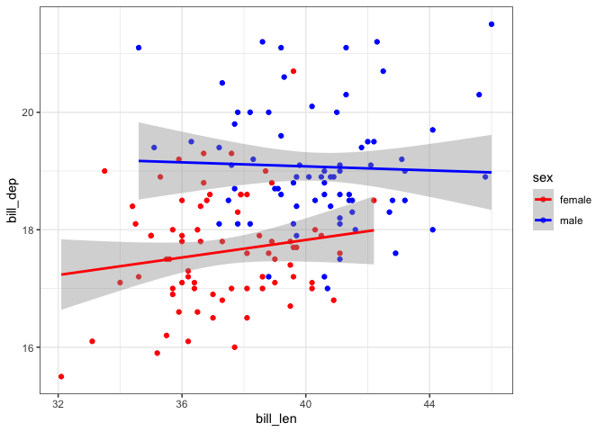
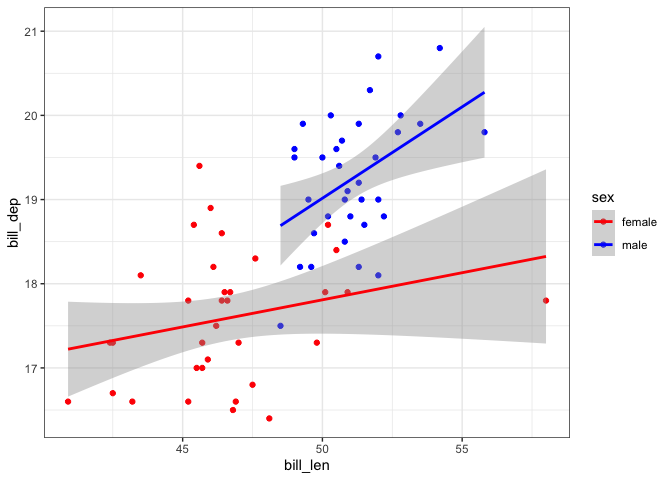
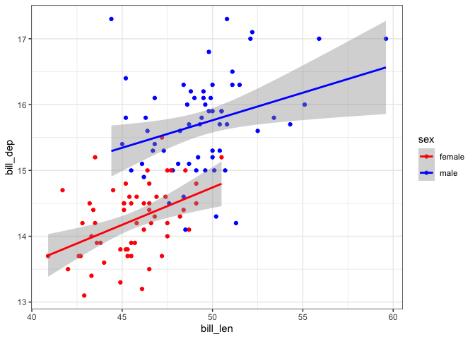

# Week 10 Problem Set


## Assignment Introduction

This week we’ve been learning about ways to iterate in R. Please create
a Quarto document that matches the style and formatting that you see
here. Once your code is finalized, hide messages and warnings throughout
the document.

Commit your final `week10_PS.qmd`, `week10_PS.md`, and associated figure
folder to the `problem_sets` folder in your GitHub repository.

**Deadline**: 11/10/25 10pm

## Iterations and Functions

Load all necessary packages.

``` r
## add your code here
```

### Exercise 1

This exercise uses the `penguins` dataset to continue practicing with
`for` loops.

#### 1.1 Using a `for` loop create separate dataframes for each species within the `penguins` dataset. The code here is quite simple, but getting each dataframe to save separately can be tricky! Read up on the `assign()` function to accomplish this.

Note: In class we focused our iteration over a numeric values in a
vector, you’ll see here that the elements we’re iterating over can also
be characters.

``` r
## add your code here
```

#### 1.2 Using a `for` loop, create three separate plots comparing `bill_len` and `bill_dep` for each species separated by sex. To get a `ggplot` to display when called inside a `for` loop, you will need to use the `print()` function.

``` r
## add your code here
```







#### 1.3 Rather than just displaying the plots from the previous exercise, rewrite your loop to save each plot as a separate PDF with the dimensions 4” x 5”. For this exercise, you will need to combine `ggsave()` with a `stringr` function. Include these PDFs in your final submission on GitHub.

Note: I saved my figures as `Exercise1.3_Adelie.pdf`,
`Exercise1.3_Chinstrap.pdf`, and `Exercise1.3_Gentoo.pdf`, but you can
save in any way you’d like!

``` r
## add your code here
```

### Exercise 2

Now for a bit more practice creating and combining functions…

#### 2.1 Create a function called `volume_calculation` that estimates the volume of a cylinder when given a value for height and radius. Test out your function.

``` r
## add your code here
```

#### 2.2 The volume of a cone is calculated very similarly to the volume of a cylinder. Make your function more general to be able to calculate the volume of a cylinder *or* a cone. Test out your function.

``` r
## add your code here
```

#### 2.3 We could calculate the mass of an object by multiplying the volume by the density. Write a function called `mass_calculation` to automate this calculation.

``` r
## add your code here
```

#### 2.4 You can combine functions you write in a variety of ways (just like functions from R packages)! Try out a few different ways of combining and implementing the functions you’ve written (e.g., in sequence, nested together, piped).

Assume a cylinder with height 10, radius 1, and density 100 for your
calculation.

``` r
## add your code here
```

### Exercise 3

#### 3.1 Write a function to automate something you’ve coded previously in a problem set for this class (or in your own research).

``` r
## add your code here
```
