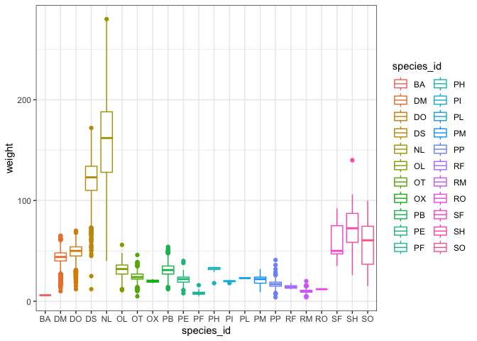
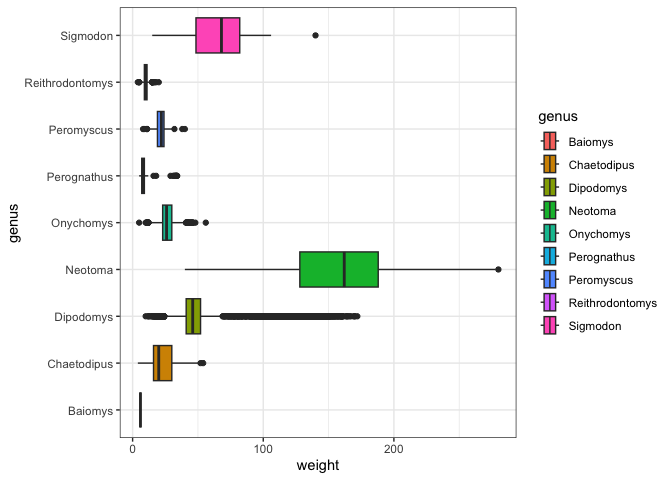

# Week 3 Problem Set


## Assignment Introduction

This week we’ve been learning about **data types** and **data
structures**. Similar to last week, please create a Quarto document that
matches the style and formatting that you see here. As you’ve also
learned some new Quarto skills this week, your Quarto document will be
getting more complex!

Commit your final `week3_PS.qmd`, `week3_PS.md`, and associated figure
folder to the `problem_sets` folder in your GitHub repository.

***Don’t forget to take advantage of the R for Data Science [Section
28.5.2](https://r4ds.hadley.nz/quarto.html#chunk-options) for help
modifying Quarto code chunks.***

**Deadline**: 10/22/25 10pm

## The basics of working with data types and structures

Don’t forget to load the `tidyverse`!

(Show your code, but hide the load message.)

``` r
library(tidyverse)
```

### Exercise 1

This exercise explores the relationship between weight (`weight`) and
species (`species_id`) of rodents found in a subset of the `ratdat`
dataset.

#### 1.1 Download the `rodents_at_control_plots.tsv` dataset from the `dataset` folder in the [course GitHub](https://github.com/stepfanie-aguillon/eeb201-R-course) and load it into R using the appropriate `readr` function. Assign the dataset as `rodents_only`.

(Don’t hide the resulting load message.)

``` r
## add your code here
```

``` r
Rows: 13972 Columns: 13
── Column specification ────────────────────────────────────────────────────────
Delimiter: "\t"
chr (6): species_id, sex, genus, species, taxa, plot_type
dbl (7): record_id, month, day, year, plot_id, hindfoot_length, weight

ℹ Use `spec()` to retrieve the full column specification for this data.
ℹ Specify the column types or set `show_col_types = FALSE` to quiet this message.
```

#### 1.2 Run two different commands to identify the data structure of `rodents_only`.

``` r
## add your code here
```

``` r
## add your code here
```

The `rodents_only` dataset is a \[include your answer here\].

#### 1.3 Two useful functions when working with data are `head()` and `tail()`, which show the top and bottom of a given dataset, respectively. Use `?head` to read about this function and use it to show the following results.

(Hide your code for this question and only show the output.)

``` r
# A tibble: 5 × 13
  record_id month   day  year plot_id species_id sex   hindfoot_length weight
      <dbl> <dbl> <dbl> <dbl>   <dbl> <chr>      <chr>           <dbl>  <dbl>
1       845     5     6  1978       2 NL         M                  32    204
2      1164     8     5  1978       2 NL         M                  34    199
3      1261     9     4  1978       2 NL         M                  32    197
4      1756     4    29  1979       2 NL         M                  33    166
5      1818     5    30  1979       2 NL         M                  32    184
# ℹ 4 more variables: genus <chr>, species <chr>, taxa <chr>, plot_type <chr>
```

#### 1.4 Next, let’s explore the data types within `rodents_only`. For this, we’ll use inline code. Read about using inline code in Quarto documents here: <https://quarto.org/docs/get-started/computations/rstudio.html#inline-code>.

The `weight` variable is a **enter inline code here** vector.

The `species_id` variable is a **enter inline code here** vector.

#### 1.5 Let’s change `species_id` to a factor variable. Write code below so that you get `TRUE` when you run the next included command.

``` r
## add your code here
```

``` r
is.factor(rodents_only$species_id)
```

#### 1.6 Write code to list the variables within `species_id` as shown below.

``` r
## add your code here
```

``` r
 [1] "BA" "DM" "DO" "DS" "NL" "OL" "OT" "OX" "PB" "PE" "PF" "PH" "PI" "PL" "PM"
[16] "PP" "RF" "RM" "RO" "SF" "SH" "SO"
```

#### 1.7 Explore the relationship between `species_id` and `weight` with a boxplot.

``` r
## add your code here
```



#### 1.8 Explore the relationship between `genus` and `weight` with a boxplot.

(Hide your code for this question and only show the resulting figure.)



#### 1.9 Include the code for the previous figure in a code chunk, but *don’t* show the figure.

``` r
## add your code here
```

### Exercise 2

Now for a bit of practice creating vectors and matrices…

#### 2.1 Create a logical vector called `x` with a length of 10. Include code below so that you get `TRUE` and `10` when you run the next included commands.

``` r
## add your code here
```

``` r
is.logical(x)
length(x)
```

#### 2.2 Create a character vector called `y` with a length of 5. Include code below so that you get `TRUE` and `5` when you run the next included commands.

``` r
## add your code here
```

``` r
is.character(y)
length(y)
```

#### 2.3 Create a matrix called `z` using the following code. Use the Environment panel to view what this matrix looks like. Use `?matrix` to read about the details of running this function.

``` r
z <- matrix(1:36, nrow = 4, ncol = 9)
```

#### 2.4 Let’s end with two useful functions `nrow()` and `ncol()`. These return the number of rows or number of columns, respectively, in a matrix or data frame.

When running these on our new matrix `z`, we should get `4` and `9` as
we specified in the `matrix()` function.

``` r
nrow(z)
```

    [1] 4

``` r
ncol(z)
```

    [1] 9

Run these commands as inline code for the `rodents_only` dataset from
Exercise 1. (The results should match what you see in the Environment
panel.)

The `rodents_only` dataset has **enter inline code here** rows.

The `rodents_only` dataset has **enter inline code here** columns.
