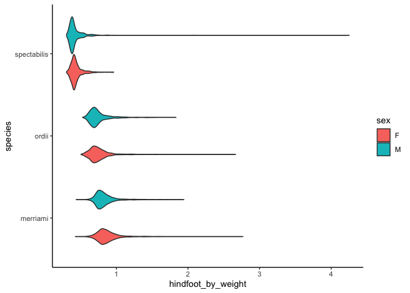
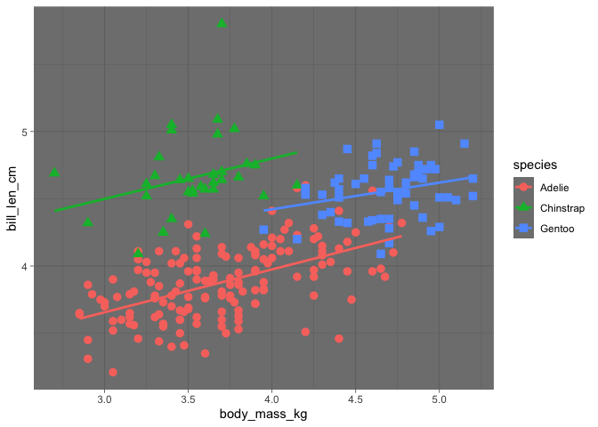

# Week 4 Problem Set


## Assignment Introduction

This week we’ve been learning the basics of **`dplyr`**. Please create a
Quarto document that matches the style and formatting that you see here.
Once your code is finalized, use your new code chunk skills to hide
messages and warnings throughout the document.

**Throughout this assignment, you will be creating many data frames.
Please show the first 5 lines of these data frames where appropriate.**

Commit your final `week4_PS.qmd`, `week4_PS.md`, and associated figure
folder to the `problem_sets` folder in your GitHub repository.

**Deadline**: 10/29/25 10pm

## `dplyr`: Part 1

Don’t forget to load the `tidyverse`!

``` r
## add your code here
```

### Exercise 1

This exercise continues working with a subset of the `ratdat` dataset
`rodents_at_control_plots.tsv`. Download the dataset from the course
GitHub (if you haven’t already) and load into R as `rodents_only`.

``` r
## add your code here
```

#### 1.1 We will be practicing our new `dplyr` data wrangling skills! Start by showing how `rodents_only` looks at the start.

``` r
## add your code here
```

``` r
# A tibble: 5 × 13
  record_id month   day  year plot_id species_id sex   hindfoot_length weight
      <dbl> <dbl> <dbl> <dbl>   <dbl> <chr>      <chr>           <dbl>  <dbl>
1       845     5     6  1978       2 NL         M                  32    204
2      1164     8     5  1978       2 NL         M                  34    199
3      1261     9     4  1978       2 NL         M                  32    197
4      1756     4    29  1979       2 NL         M                  33    166
5      1818     5    30  1979       2 NL         M                  32    184
# ℹ 4 more variables: genus <chr>, species <chr>, taxa <chr>, plot_type <chr>
```

#### 1.2 BUT that table isn’t particularly easy to read… so let’s use a command in the `knitr` package. Install (if necessary) and load `knitr`, then run `kable(<your_answer_to_1.1>)`.

``` r
## add your code here
```

| **record_id** | **month** | **day** | **year** | **plot_id** | **species_id** | **sex** | **hindfoot_length** | **weight** | **genus** | **species** | **taxa** | **plot_type** |
|---:|---:|---:|---:|---:|:---|:---|---:|---:|:---|:---|:---|:---|
| 845 | 5 | 6 | 1978 | 2 | NL | M | 32 | 204 | Neotoma | albigula | Rodent | Control |
| 1164 | 8 | 5 | 1978 | 2 | NL | M | 34 | 199 | Neotoma | albigula | Rodent | Control |
| 1261 | 9 | 4 | 1978 | 2 | NL | M | 32 | 197 | Neotoma | albigula | Rodent | Control |
| 1756 | 4 | 29 | 1979 | 2 | NL | M | 33 | 166 | Neotoma | albigula | Rodent | Control |
| 1818 | 5 | 30 | 1979 | 2 | NL | M | 32 | 184 | Neotoma | albigula | Rodent | Control |

#### 1.3 Create a new data frame that includes only species in the genus *Dipodomys* with observations listed in reverse alphabetical order by species name. Perform these processing steps using the pipe (`%>%`).

``` r
## add your code here
```

| **record_id** | **month** | **day** | **year** | **plot_id** | **species_id** | **sex** | **hindfoot_length** | **weight** | **genus** | **species** | **taxa** | **plot_type** |
|---:|---:|---:|---:|---:|:---|:---|---:|---:|:---|:---|:---|:---|
| 585 | 2 | 18 | 1978 | 2 | DS | M | 53 | 157 | Dipodomys | spectabilis | Rodent | Control |
| 657 | 3 | 11 | 1978 | 2 | DS | M | 54 | 153 | Dipodomys | spectabilis | Rodent | Control |
| 731 | 4 | 8 | 1978 | 2 | DS | F | 47 | 110 | Dipodomys | spectabilis | Rodent | Control |
| 835 | 5 | 6 | 1978 | 2 | DS | M | 53 | 149 | Dipodomys | spectabilis | Rodent | Control |
| 934 | 5 | 19 | 1978 | 2 | DS | F | 47 | 114 | Dipodomys | spectabilis | Rodent | Control |

#### 1.4 Another useful function when working with data is `dim()`. Use `?dim` to read the details on running this function and use it to determine the dimensions of your new data frame.

``` r
## add your code here
```

#### 1.5 In your *Dipodomys* data frame, keep only the columns `month`, `day`, `year`, `plot_id`, `sex`, `hindfoot_length`, `weight`, `genus`, and `species`. Read the documentation about your chosen function to see if there is an easier way to keep all of these columns than typing them out one by one!

``` r
## add your code here
```

| **month** | **day** | **year** | **plot_id** | **sex** | **hindfoot_length** | **weight** | **genus** | **species** |
|---:|---:|---:|---:|:---|---:|---:|:---|:---|
| 2 | 18 | 1978 | 2 | M | 53 | 157 | Dipodomys | spectabilis |
| 3 | 11 | 1978 | 2 | M | 54 | 153 | Dipodomys | spectabilis |
| 4 | 8 | 1978 | 2 | F | 47 | 110 | Dipodomys | spectabilis |
| 5 | 6 | 1978 | 2 | M | 53 | 149 | Dipodomys | spectabilis |
| 5 | 19 | 1978 | 2 | F | 47 | 114 | Dipodomys | spectabilis |

#### 1.6 In your *Dipodomys* data frame, create a new variable called `hindfoot_by_weight` that divides hindfoot length by weight and then use this variable to create the following plot.

``` r
## add your code here
```



#### 1.7 From the *Dipodomys* data frame, create a new data frame that includes only observations where the weight is larger than the mean weight of all individuals. (Hint: you can do this step-wise, **or** you can do this all inside your `dplyr` command!) Arrange your resulting data frame by weight.

``` r
## add your code here
```

| **month** | **day** | **year** | **plot_id** | **sex** | **hindfoot_length** | **weight** | **genus** | **species** | **hindfoot_by_weight** |
|---:|---:|---:|---:|:---|---:|---:|:---|:---|---:|
| 2 | 25 | 1980 | 2 | F | 37 | 55 | Dipodomys | ordii | 0.6727273 |
| 5 | 28 | 1987 | 2 | F | 34 | 55 | Dipodomys | ordii | 0.6181818 |
| 9 | 12 | 1988 | 2 | M | 37 | 55 | Dipodomys | ordii | 0.6727273 |
| 3 | 13 | 1989 | 2 | M | 36 | 55 | Dipodomys | ordii | 0.6545455 |
| 4 | 21 | 1991 | 2 | F | 36 | 55 | Dipodomys | ordii | 0.6545455 |

This final data frame has **enter inline code here** rows and **enter
inline code here** columns.

### Exercise 2

This exercise works with our favorite `penguins` dataset.

#### 2.1 Using a single `filter()` statement, create a new data frame that includes Adelie penguins *or* females of any species. Order this new data frame by body mass.

``` r
## add your code here
```

| **species** | **island** | **bill_len** | **bill_dep** | **flipper_len** | **body_mass** | **sex** | **year** |
|:---|:---|---:|---:|---:|---:|:---|---:|
| Chinstrap | Dream | 46.9 | 16.6 | 192 | 2700 | female | 2008 |
| Adelie | Biscoe | 36.5 | 16.6 | 181 | 2850 | female | 2008 |
| Adelie | Biscoe | 36.4 | 17.1 | 184 | 2850 | female | 2008 |
| Adelie | Biscoe | 34.5 | 18.1 | 187 | 2900 | female | 2008 |
| Adelie | Dream | 33.1 | 16.1 | 178 | 2900 | female | 2008 |

#### 2.2 The variables for bill length and depth are measured in millimeters, while body mass is measured in grams. Using a single `mutate()` function, create three new variables where bill measurements are expressed in centimeters and body mass is measured in kilograms.

``` r
## add your code here
```

| **species** | **island** | **bill_len** | **bill_dep** | **flipper_len** | **body_mass** | **sex** | **year** | **bill_len_cm** | **bill_dep_cm** | **body_mass_kg** |
|:---|:---|---:|---:|---:|---:|:---|---:|---:|---:|---:|
| Chinstrap | Dream | 46.9 | 16.6 | 192 | 2700 | female | 2008 | 4.69 | 1.66 | 2.70 |
| Adelie | Biscoe | 36.5 | 16.6 | 181 | 2850 | female | 2008 | 3.65 | 1.66 | 2.85 |
| Adelie | Biscoe | 36.4 | 17.1 | 184 | 2850 | female | 2008 | 3.64 | 1.71 | 2.85 |
| Adelie | Biscoe | 34.5 | 18.1 | 187 | 2900 | female | 2008 | 3.45 | 1.81 | 2.90 |
| Adelie | Dream | 33.1 | 16.1 | 178 | 2900 | female | 2008 | 3.31 | 1.61 | 2.90 |
| Adelie | Torgersen | 38.6 | 17.0 | 188 | 2900 | female | 2009 | 3.86 | 1.70 | 2.90 |

#### 2.3 Using these new variables, create the following plot. Hint: Look up options for the geoms you’re using! And new themes!

``` r
## add your code here
```



#### 2.4 Let’s end by learning a useful option within `filter()` called `%in%`. Going back to the original `penguins` dataset, create a new data frame of all penguins from Biscoe and Dream Islands using `%in%`. Hint: Look in [section 5.2.2](https://r4ds.had.co.nz/transform.html) of R For Data Science for details on how `%in%` works.

``` r
## add your code here
```

| **species** | **island** | **bill_len** | **bill_dep** | **flipper_len** | **body_mass** | **sex** | **year** |
|:---|:---|---:|---:|---:|---:|:---|---:|
| Adelie | Biscoe | 37.8 | 18.3 | 174 | 3400 | female | 2007 |
| Adelie | Biscoe | 37.7 | 18.7 | 180 | 3600 | male | 2007 |
| Adelie | Biscoe | 35.9 | 19.2 | 189 | 3800 | female | 2007 |
| Adelie | Biscoe | 38.2 | 18.1 | 185 | 3950 | male | 2007 |
| Adelie | Biscoe | 38.8 | 17.2 | 180 | 3800 | male | 2007 |
| Adelie | Biscoe | 35.3 | 18.9 | 187 | 3800 | female | 2007 |

The dimensions of this final data frame is **enter inline code here**.
