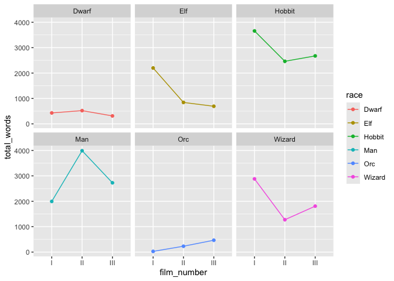

# Week 5 Problem Set


## Assignment Introduction

This week we’ve been continuing to work with **`dplyr`**. Please create
a Quarto document that matches the style and formatting that you see
here. Once your code is finalized, use your new code chunk skills to
hide messages and warnings throughout the document.

**Throughout this assignment, you will be creating many data frames.
Please show the first 5 lines of these data frames where appropriate.**

Commit your final `week5_PS.qmd`, `week5_PS.md`, and associated figure
folder to the `problem_sets` folder in your GitHub repository.

**Deadline**: 11/05/25 10pm

## `dplyr`: Part 2

Load all necessary packages in a code chunk that is evaluated, but not
visible in the final rendered Quarto.

``` r
## add your code here
```

### Exercise 1

This exercise explores a new dataset that includes the number of words
spoken by different characters in each of the three Lord of the Rings
movies (separated by “chapters” of the movies). Download the dataset
from the course website (`lotr_dataset.txt`) and load it into R as
`lotr_df`.

``` r
## add your code here
```

#### 1.1 We will be continuing to practice our new `dplyr` data wrangling skills! Start by showing how `lotr_df` looks at the start.

``` r
## add your code here
```

| Film_Number | Film_Name | Chapter_Number | Chapter_Name | Character | Race | Words |
|:---|:---|:---|:---|:---|:---|---:|
| I | The Fellowship Of The Ring | 01 | Prologue | Bilbo | Hobbit | 4 |
| I | The Fellowship Of The Ring | 01 | Prologue | Elrond | Elf | 5 |
| I | The Fellowship Of The Ring | 01 | Prologue | Galadriel | Elf | 460 |
| I | The Fellowship Of The Ring | 02 | Concerning Hobbits | Bilbo | Hobbit | 214 |
| I | The Fellowship Of The Ring | 03 | The Shire | Bilbo | Hobbit | 70 |

#### 1.2 Rename all of the column names without capital letters and keep only the `film_number`, `film_name`, `chapter_number`, `character`, `race`, and `words` columns. (Hint: You can do the latter very simply! Check out the documentation for your `dplyr` function!)

``` r
## add your code here
```

| film_number | film_name                  | chapter_number | character | race   | words |
|:------------|:---------------------------|:---------------|:----------|:-------|------:|
| I           | The Fellowship Of The Ring | 01             | Bilbo     | Hobbit |     4 |
| I           | The Fellowship Of The Ring | 01             | Elrond    | Elf    |     5 |
| I           | The Fellowship Of The Ring | 01             | Galadriel | Elf    |   460 |
| I           | The Fellowship Of The Ring | 02             | Bilbo     | Hobbit |   214 |
| I           | The Fellowship Of The Ring | 03             | Bilbo     | Hobbit |    70 |

#### 1.3 We introduced two potential ways you could rename columns in `dplyr`. Include, **but do not evaluate,** code below for an alternative way to rename all of the column names without capital letters.

``` r
## add your code here
```

#### 1.4 Create a new data frame that includes only the top 10 number of words spoken in The Return of the King. Show the entire data frame for this question.

``` r
## add your code here
```

| film_number | film_name              | chapter_number | character | race   | words |
|:------------|:-----------------------|:---------------|:----------|:-------|------:|
| III         | The Return Of The King | 04             | Saruman   | Wizard |   301 |
| III         | The Return Of The King | 12             | Gandalf   | Wizard |   268 |
| III         | The Return Of The King | 08             | Gandalf   | Wizard |   255 |
| III         | The Return Of The King | 11             | Gandalf   | Wizard |   202 |
| III         | The Return Of The King | 27             | Sam       | Hobbit |   184 |
| III         | The Return Of The King | 30             | Elrond    | Elf    |   168 |
| III         | The Return Of The King | 14             | Gandalf   | Wizard |   163 |
| III         | The Return Of The King | 11             | Denethor  | Man    |   151 |
| III         | The Return Of The King | 08             | Merry     | Hobbit |   135 |
| III         | The Return Of The King | 76             | Frodo     | Hobbit |   132 |

#### 1.5 From the original `lotr_df`, summarize the minimum, maximum, and average number of words spoken by each character.

``` r
## add your code here
```

| character | min_words | max_words | mean_words |
|:----------|----------:|----------:|-----------:|
| Aragorn   |         1 |       103 |   38.06557 |
| Arwen     |         8 |       131 |   61.37500 |
| Bilbo     |         4 |       339 |  124.18182 |
| Boromir   |         2 |       220 |   71.80000 |
| Boson     |         7 |         7 |    7.00000 |

#### 1.6 BUT maybe there is a better way to summarize this particular dataset! Instead, let’s summarize the *total number* of words spoken (`total_words`) by each character across all films. Arrange your resulting data frame by `total_words` (most to least).

``` r
## add your code here
```

| character | total_words |
|:----------|------------:|
| Gandalf   |        4828 |
| Sam       |        2525 |
| Aragorn   |        2322 |
| Frodo     |        2281 |
| Bilbo     |        1366 |

#### 1.7 Let’s take this one step further… For each film, summarize the number of chapters a character speaks in (`count`) and their total number of words spoken (`total_words`). To really focus in, let’s look only at the original 9 members of The Fellowship. Arrange your resulting data frame by `total_words` (most to least).

Here’s a list of the 9 members of The Fellowship:

``` r
fellowship9 <- c("Frodo", "Sam", "Merry", "Pippin", "Gandalf", "Aragorn", "Legolas", "Gimli", "Boromir")
```

Hint: There are a number of different ways you can approach this
problem! Think about the different steps you need to complete and how
you want to order them in your code.

``` r
## add your code here
```

| character | film_name                  | count | total_words |
|:----------|:---------------------------|------:|------------:|
| Gandalf   | The Fellowship Of The Ring |    20 |        2360 |
| Gandalf   | The Return Of The King     |    23 |        1504 |
| Sam       | The Two Towers             |    14 |        1044 |
| Frodo     | The Fellowship Of The Ring |    25 |         967 |
| Gandalf   | The Two Towers             |     8 |         964 |

### Exercise 2

Let’s practice modifying plots using this Lord of the Rings dataset!

#### 2.1 First, we’ll need one final summary dataset. Summarize the total number of words spoken (`total_words`) for each race in each of the three movies.

``` r
## add your code here
```

| film_number | race   | total_words |
|:------------|:-------|------------:|
| I           | Dwarf  |         431 |
| I           | Elf    |        2200 |
| I           | Hobbit |        3658 |
| I           | Man    |        1995 |
| I           | Orc    |          27 |

#### 2.2 Explore the relationship between race and the total number of words spoken across the three films. Hint: To connect the lines in the way they are shown in this figure, you will need to use `group = race` in the aesthetics command for one of your two geoms.

``` r
## add your code here
```



#### 2.3 Use your `ggplot` skills to make the visualization of this plot *BETTER*. Employ at least 5 different plotting options. Show the code and your resulting figure.

``` r
## add your code here
```

#### 2.4 Use your `ggplot` skills to make the visualization of this plot *WORSE*. Employ at least 5 different plotting options. Show the code and your resulting figure. Worst plot wins a prize!

``` r
## add your code here
```
