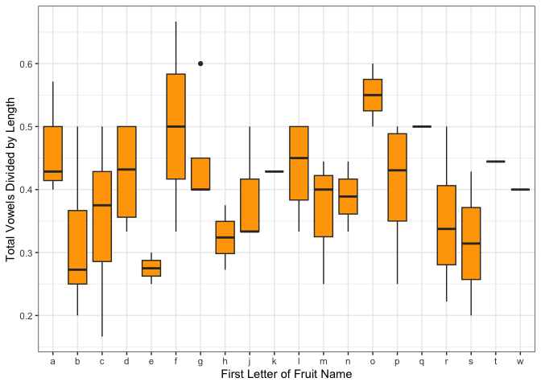
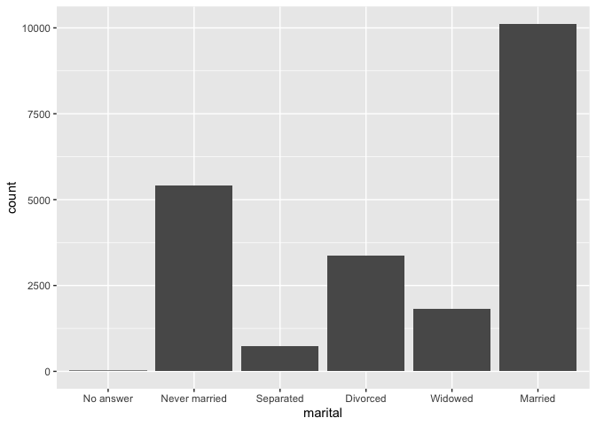
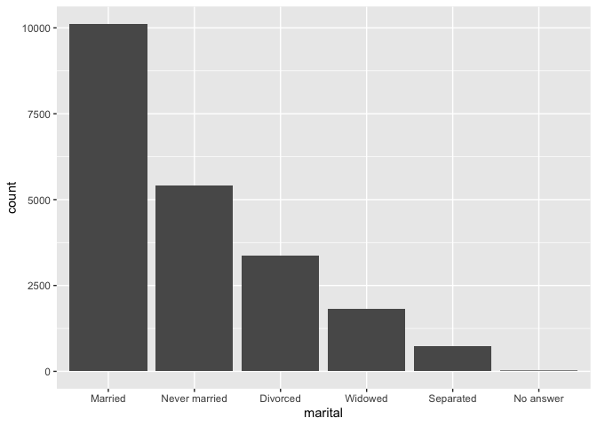
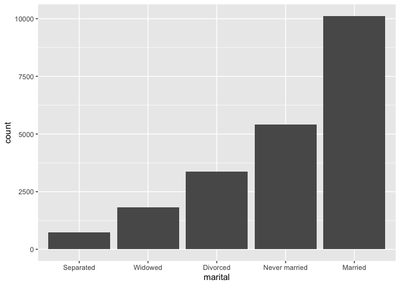
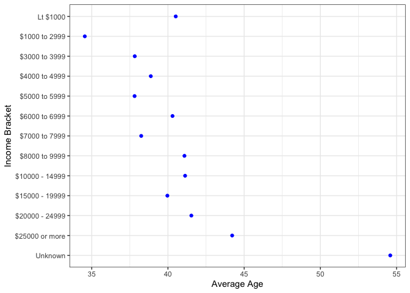

# Week 8 Problem Set


## Assignment Introduction

This week we’re doing a whirlwind tour of strings, factors, and dates.
Please create a Quarto document that matches the style and formatting
that you see here. Once your code is finalized, hide messages and
warnings throughout the document.

**Throughout this assignment, you will be creating many data frames.
Please show the first 5 lines of these data frames where appropriate.**

Commit your final `week8_PS.qmd`, `week8_PS.md`, and associated figure
folder to the `problem_sets` folder in your GitHub repository.

**Deadline**: 11/26/25 10pm

## Strings, Factors, and Dates

Load all necessary packages.

``` r
## add your code here
```

### Exercise 1

This exercise uses the `fruit` dataset within `stringr` to demonstrate
how you might work with strings within a real dataset in combination
with other `tidyverse` packages.

#### 1.1 Using the `fruit` dataset as a starting point, create a new tibble called `fruit_counts` that includes a column for the fruit string (`fruit_name`) and additional columns with counts of the numbers of each vowel within the fruit string.

``` r
## add your code here
```

| fruit_name  | a_count | e_count | i_count | o_count | u_count |
|:------------|--------:|--------:|--------:|--------:|--------:|
| apple       |       1 |       1 |       0 |       0 |       0 |
| apricot     |       1 |       0 |       1 |       1 |       0 |
| avocado     |       2 |       0 |       0 |       2 |       0 |
| banana      |       3 |       0 |       0 |       0 |       0 |
| bell pepper |       0 |       3 |       0 |       0 |       0 |

#### 1.2 It turns out there is a typo in one of the fruit names in `fruit_counts`! “pamelo” isn’t a real fruit name… just a typo of “pomelo”, which is already included. Identify the index of the “pamelo” typo and remove that row using the index number (rather than with a filter function).

`pamelo` was found on row **\[add in text code here\]**.

``` r
## add your code here
```

#### 1.3 There are a number of fruits with spaces in their names. Remove all of these fruits from your dataset.

``` r
## add your code here
```

| fruit_name | a_count | e_count | i_count | o_count | u_count |
|:-----------|--------:|--------:|--------:|--------:|--------:|
| apple      |       1 |       1 |       0 |       0 |       0 |
| apricot    |       1 |       0 |       1 |       1 |       0 |
| avocado    |       2 |       0 |       0 |       2 |       0 |
| banana     |       3 |       0 |       0 |       0 |       0 |
| bilberry   |       0 |       1 |       1 |       0 |       0 |

#### 1.4 Finally, for a multi-step exercise. Use your skills to produce a figure that matches what you see below.

Hint: This will require using skills you’ve learned across multiple
parts of the course. Start by looking at the “Subset Strings” section of
the `stringr` Cheatsheet. If you want additional hints on how to
approach this exercise, message me on Slack!

``` r
## add your code here
```



### Exercise 2

This exercise uses the `gss_cat` dataset within `forcats` to demonstrate
how you might work with factors within a real dataset in combination
with other `tidyverse` functions. `gss_cat` includes a sample of results
from the [General Social Survey](https://gss.norc.org) with many factor
variables.

#### 2.1 Using the `gss_cat` dataset as a starting point, create a new dataset called `gss_subsample` that includes only the columns for `year`, `marital`, `age`, and `rincome`. Show the number of values within each level of `marital` and `rincome` using `forcats`.

``` r
## add your code here
```

| year | marital       | age | rincome        |
|-----:|:--------------|----:|:---------------|
| 2000 | Never married |  26 | \$8000 to 9999 |
| 2000 | Divorced      |  48 | \$8000 to 9999 |
| 2000 | Widowed       |  67 | Not applicable |
| 2000 | Never married |  39 | Not applicable |
| 2000 | Divorced      |  25 | Not applicable |

``` r
## add your code here
```

| f             |     n |
|:--------------|------:|
| No answer     |    17 |
| Never married |  5416 |
| Separated     |   743 |
| Divorced      |  3383 |
| Widowed       |  1807 |
| Married       | 10117 |

``` r
## add your code here
```

| f               |    n |
|:----------------|-----:|
| No answer       |  183 |
| Don’t know      |  267 |
| Refused         |  975 |
| \$25000 or more | 7363 |
| \$20000 - 24999 | 1283 |
| \$15000 - 19999 | 1048 |
| \$10000 - 14999 | 1168 |
| \$8000 to 9999  |  340 |
| \$7000 to 7999  |  188 |
| \$6000 to 6999  |  215 |
| \$5000 to 5999  |  227 |
| \$4000 to 4999  |  226 |
| \$3000 to 3999  |  276 |
| \$1000 to 2999  |  395 |
| Lt \$1000       |  286 |
| Not applicable  | 7043 |

#### 2.2 One of the places where factors and their order matters the most is when plotting. Before we make any changes, let’s look at the order of the `marital` variable using a bar plot.

Note: Think carefully about when ([or
if](https://research.psy.uq.edu.au/dorn/losing-the-plot/)) a bar plot is
the appropriate way to plot your data! More on this next week…

``` r
## add your code here
```



#### 2.3 Reorder the levels of `marital` by the frequency in which they appear in the dataset and re-plot the figure. See if you can figure out how to do this completely within your `ggplot` command without changing the levels of the dataset itself!

Note: I’ve changed the axis label to not give away the within `ggplot`
solution.

``` r
## add your code here
```



#### 2.4 The “No answer” selection isn’t really useful for this visualization. Remove all observations with “No answer” and remove the factor level itself. Re-plot so that the bars go from smallest to largest.

Note: I’ve changed the axis label to not give away the within `ggplot`
solution.

``` r
## add your code here
```



#### 2.5 Finally, let’s look at the `rincome` factor for a multi-step exercise. Use your skills to produce a figure that matches what you see below.

Hint: This will require using skills you’ve learned across multiple
parts of the course. Start by looking at the “Change the Value of
Levels” section of the `forcats` Cheatsheet. If you want additional
hints on how to approach this exercise, message me on Slack!

``` r
## add your code here
```



### Exercise 3

This exercise takes us back to the `ratdat_surveys.csv` dataset to
practice different approaches to work with dates and times in
`lubridate`.

#### 3.1 Load the dataset into R as `ratdat_surveys` and take a look at the first few rows of data to see how things look when we start. For ease of viewing, keep only the `species_id` and `date` columns. (Can you do this without saving any intermediates?)

``` r
## add your code here
```

| species_id | date       |
|:-----------|:-----------|
| BA         | 4-24-1990  |
| BA         | 10-10-1991 |
| BA         | 1-12-1991  |
| BA         | 10-16-1990 |
| BA         | 11-14-1991 |

#### 3.2 Use the appropriate `lubridate` option to parse the `date` column as a date variable. Do you notice anything change when you do this?

Hint: Look into the “Parse Date-Times” section of the `lubridate`
Cheatsheet to find the appropriate function(s).

``` r
## add your code here
```

| species_id | date       |
|:-----------|:-----------|
| BA         | 1990-04-24 |
| BA         | 1991-10-10 |
| BA         | 1991-01-12 |
| BA         | 1990-10-16 |
| BA         | 1991-11-14 |

#### 3.3 Now that R knows this column is actually a date variable, use `lubridate` in combination with other `tidyverse` packages to separate the `date` column into three separate columns: `month`, `day`, and `year`.

Hint: Look into the “Get and Set Components” section of the `lubridate`
Cheatsheet to find the appropriate function(s).

``` r
## add your code here
```

| species_id | date       | month | day | year |
|:-----------|:-----------|------:|----:|-----:|
| BA         | 1990-04-24 |     4 |  24 | 1990 |
| BA         | 1991-10-10 |    10 |  10 | 1991 |
| BA         | 1991-01-12 |     1 |  12 | 1991 |
| BA         | 1990-10-16 |    10 |  16 | 1990 |
| BA         | 1991-11-14 |    11 |  14 | 1991 |

#### 3.4 Finally, instead of doing this process *after* the dataset is already loaded, re-load the dataset as `ratdat_surveys_date` and indicate to `readr` it should load the `date` column as a date variable. As a bonus, also tell `readr` to load the `species_id` column as a factor. After you do this, you should get `TRUE` when you run the two included commands.

``` r
## add your code here
#is.factor(ratdat_surveys_date$species_id)
#is.Date(ratdat_surveys_date$date)
```
